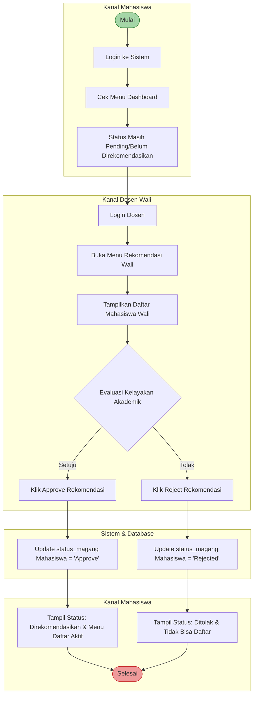
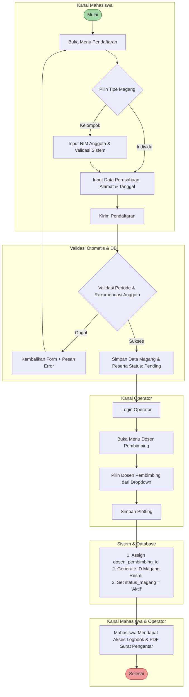
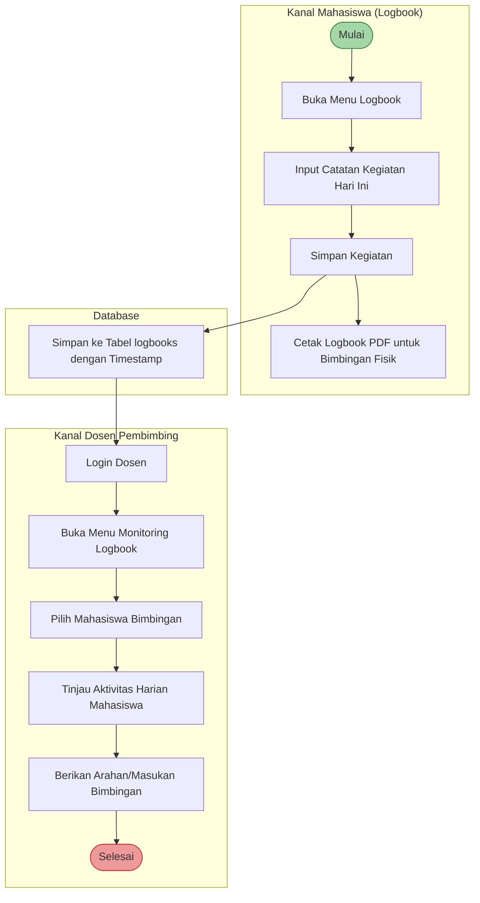
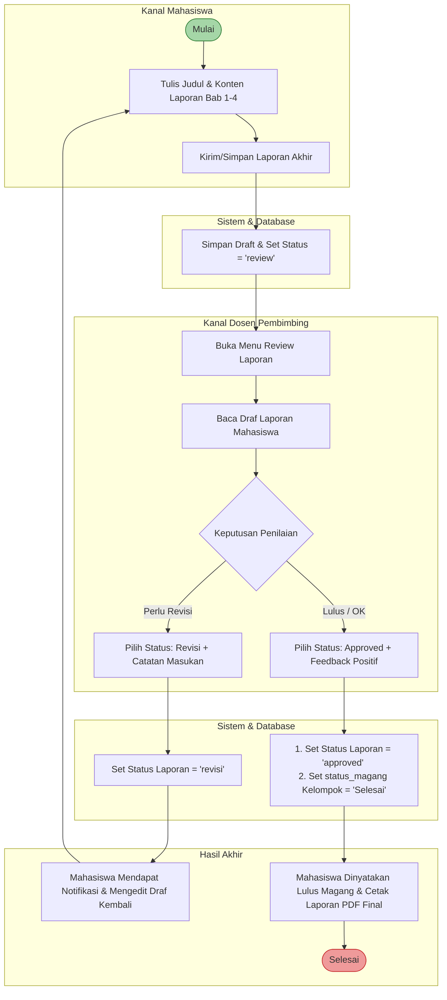
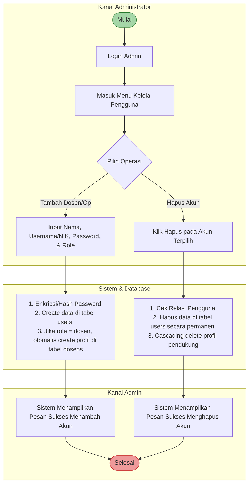

# Dokumen Analisis Fungsional: Use Case & User Activity
**Sistem Informasi Magang (SIDUL)**

Dokumen ini disusun khusus berdasarkan struktur kode program, model data, *database schema*, dan controller yang ada pada proyek **SIDUL**. Dokumen ini menggunakan format akademis standar yang siap Anda gunakan atau adaptasi ke dalam bab analisis dan perancangan sistem pada Laporan/Buku Skripsi Anda.

---

## 1. Identifikasi Aktor (Actors)

Berdasarkan analisis *middleware*, *routes*, dan *seeder* di proyek SIDUL, terdapat **4 Aktor Utama** dengan hak akses dan peran masing-masing:

| No | Aktor | Deskripsi Peran & Tanggung Jawab |
|:---|:---|:---|
| 1 | **Mahasiswa** | Mengajukan permohonan magang, menginput logbook harian, menyusun draf laporan magang (Bab 1 - Bab 4), mengunduh surat pengantar, serta mencetak dokumen (PDF) laporan & logbook. |
| 2 | **Dosen** | Memiliki peran ganda:  1. **Dosen Wali**: Memberikan persetujuan rekomendasi awal kelayakan magang mahasiswa wali. 2. **Dosen Pembimbing**: Memonitor aktivitas logbook harian mahasiswa bimbingan, melakukan review draf laporan per bab, memberikan catatan revisi, serta memberikan kelulusan magang (*approval* laporan). |
| 3 | **Operator** | Mengontrol periode pendaftaran magang (buka/tutup), memverifikasi pendaftaran kelompok/individu, melakukan *plotting* (penugasan) Dosen Pembimbing, menerbitkan ID Magang resmi, memonitor seluruh aktivitas magang, dan dapat menghapus pendaftaran jika terjadi kesalahan data. |
| 4 | **Admin** | Bertanggung jawab penuh terhadap manajemen data master pengguna (akun Dosen dan Operator) seperti menambahkan akun baru dan menghapus akun. |

---

## 2. Use Case Diagram

Diagram Use Case ini memetakan interaksi seluruh aktor terhadap fungsi-fungsi sistem. Hubungan autentikasi (`Login` dan `Logout`) bersifat universal untuk semua aktor.

```mermaid
graph TD
    %% Styling
    classDef actor fill:#e1f5fe,stroke:#0288d1,stroke-width:2px,color:#0277bd;
    classDef uc fill:#ede7f6,stroke:#5e35b1,stroke-width:1.5px,color:#4a148c;
    classDef base fill:#fff3e0,stroke:#ffb74d,stroke-width:2px,color:#e65100;

    %% Actors
    M["👤 Mahasiswa"]:::actor
    DW["👨‍🏫 Dosen Wali / Pembimbing"]:::actor
    OP["⚙️ Operator"]:::actor
    AD["👑 Admin"]:::actor

    %% Universal Use Cases
    UC_Login("Login Ke Sistem"):::base
    UC_Logout("Logout Dari Sistem"):::base

    %% Mahasiswa Use Cases
    subgraph Mahasiswa_Boundary ["Batas Sistem: Fitur Mahasiswa"]
        UC_M1("Mengajukan Rekomendasi Magang"):::uc
        UC_M2("Melakukan Pendaftaran Magang<br>(Individu / Kelompok)"):::uc
        UC_M3("Mengisi Logbook Harian"):::uc
        UC_M4("Mencetak Logbook ke PDF"):::uc
        UC_M5("Mengunggah/Update Laporan Magang<br>(Bab 1 s.d. Bab 4)"):::uc
        UC_M6("Mencetak Laporan ke PDF"):::uc
        UC_M7("Mengunduh Surat Pengantar Magang"):::uc
    end

    %% Dosen Use Cases
    subgraph Dosen_Boundary ["Batas Sistem: Fitur Dosen"]
        UC_D1("Verifikasi Rekomendasi Mahasiswa Wali<br>(Approve / Reject)"):::uc
        UC_D2("Monitoring Logbook Mahasiswa Bimbingan"):::uc
        UC_D3("Review & Approval Laporan Akhir<br>(Beri Masukan / Kelulusan)"):::uc
    end

    %% Operator Use Cases
    subgraph Operator_Boundary ["Batas Sistem: Fitur Operator"]
        UC_O1("Membuka / Menutup Periode Magang"):::uc
        UC_O2("Verifikasi & Validasi Pendaftaran"):::uc
        UC_O3("Plotting Dosen Pembimbing & Terbitkan ID Magang"):::uc
        UC_O4("Monitoring Seluruh Kelompok Magang"):::uc
        UC_O5("Melihat Seluruh Laporan Masuk"):::uc
        UC_O6("Menghapus Data Pendaftaran Magang"):::uc
    end

    %% Admin Use Cases
    subgraph Admin_Boundary ["Batas Sistem: Fitur Admin"]
        UC_A1("Menambahkan Akun Baru (Dosen/Operator)"):::uc
        UC_A2("Menghapus Akun Pengguna"):::uc
    end

    %% Interaksi Aktor dengan Use Case
    M --> UC_Login
    M --> UC_M1
    M --> UC_M2
    M --> UC_M7
    M --> UC_M3
    M --> UC_M4
    M --> UC_M5
    M --> UC_M6
    M --> UC_Logout

    DW --> UC_Login
    DW --> UC_D1
    DW --> UC_D2
    DW --> UC_D3
    DW --> UC_Logout

    OP --> UC_Login
    OP --> UC_O1
    OP --> UC_O2
    OP --> UC_O3
    OP --> UC_O4
    OP --> UC_O5
    OP --> UC_O6
    OP --> UC_Logout

    AD --> UC_Login
    AD --> UC_A1
    AD --> UC_A2
    AD --> UC_Logout
```

---

## 3. Spesifikasi Use Case (Use Case Specification)

Berikut adalah detail skenario utama untuk use case terpenting dalam sistem SIDUL:

### UC-01: Melakukan Pendaftaran Magang (Mahasiswa)
*   **Aktor Utama**: Mahasiswa
*   **Deskripsi**: Mahasiswa melakukan pendaftaran magang secara individu maupun kelompok (maksimal 3 orang) dengan mengisi instansi/perusahaan, alamat, dan tanggal pelaksanaan magang.
*   **Pre-kondisi**:
    1.  Akun Mahasiswa aktif dan berhasil login.
    2.  Mahasiswa telah mendapatkan rekomendasi dari **Dosen Wali** (`status_magang` bernilai `'Approve'`).
    3.  Periode pendaftaran magang sedang dibuka oleh Operator (`is_periode_open == '1'`).
    4.  Mahasiswa belum terdaftar pada kelompok magang mana pun.
*   **Post-kondisi**: Pendaftaran tersimpan dalam status `'Pending'` dan menunggu verifikasi dari Operator.
*   **Skenario Utama (Main Flow)**:
    1.  Mahasiswa masuk ke menu **Pendaftaran Magang**.
    2.  Sistem menampilkan form pendaftaran magang.
    3.  Mahasiswa memilih tipe magang (Individu / Kelompok).
    4.  *Optional (Jika Kelompok)*: Mahasiswa menginput NIM anggota kelompok. Sistem memvalidasi kelayakan akun anggota (harus sudah di-approve dosen wali & tidak terdaftar di magang lain).
    5.  Mahasiswa menginput Konsentrasi, Nama Perusahaan/Instansi, Alamat Perusahaan, Tanggal Mulai, dan Tanggal Selesai.
    6.  Mahasiswa menekan tombol **Kirim Pendaftaran**.
    7.  Sistem menyimpan data pendaftaran magang ke dalam tabel `magangs` dan membuat data ketua & anggota di tabel `peserta_magangs` dengan inisiasi status magang kelompok adalah `'Pending'`.

---

### UC-02: Plotting Dosen Pembimbing & Aktivasi Magang (Operator)
*   **Aktor Utama**: Operator
*   **Deskripsi**: Operator menetapkan Dosen Pembimbing untuk pendaftaran magang mahasiswa yang berstatus `'Pending'`. Proses ini secara otomatis mengaktifkan status magang kelompok tersebut dan menerbitkan kode ID Magang resmi.
*   **Pre-kondisi**:
    1.  Operator berhasil login.
    2.  Terdapat pengajuan pendaftaran magang mahasiswa dengan status `'Pending'`.
*   **Post-kondisi**: Status magang mahasiswa berubah menjadi `'Aktif'`, Dosen Pembimbing ditetapkan, dan kode ID Magang unik (`SIDUL-YYYY-XXX`) berhasil diterbitkan.
*   **Skenario Utama (Main Flow)**:
    1.  Operator membuka menu **Plotting Dosen Pembimbing**.
    2.  Sistem menampilkan daftar pendaftaran magang mahasiswa yang masih berstatus `'Pending'`.
    3.  Operator memilih salah satu kelompok magang dan memilih Dosen Pembimbing yang tersedia melalui *dropdown menu*.
    4.  Operator menekan tombol **Plot Dosen Pembimbing**.
    5.  Sistem memproses data:
        *   Menghasilkan ID Magang unik dengan format: `SIDUL-[Tahun_Aktif]-[NomorUrut]`.
        *   Menetapkan `dosen_pembimbing_id` pada entitas pendaftaran.
        *   Mengubah status pendaftaran (`status_magang`) dari `'Pending'` menjadi `'Aktif'`.
    6.  Sistem menampilkan pesan sukses bahwa ID Magang resmi telah diterbitkan dan magang siap dilaksanakan.

---

### UC-03: Review & Approval Laporan Akhir (Dosen Pembimbing)
*   **Aktor Utama**: Dosen Pembimbing
*   **Deskripsi**: Dosen Pembimbing meninjau draf laporan (Bab 1 s.d. Bab 4) yang diunggah mahasiswa bimbingannya, memberikan catatan revisi, atau langsung memberikan persetujuan kelulusan (*approval*).
*   **Pre-kondisi**:
    1.  Dosen berhasil login.
    2.  Mahasiswa bimbingan telah mengunggah laporan magang (status laporan adalah `'review'`).
*   **Post-kondisi**: Status laporan berubah menjadi `'revisi'` atau `'approved'`. Jika disetujui, status magang kelompok tersebut otomatis diset terhadap status `'Selesai'` (Lulus Magang).
*   **Skenario Utama (Main Flow)**:
    1.  Dosen masuk ke menu **Laporan Bimbingan**.
    2.  Sistem menampilkan daftar mahasiswa bimbingan beserta judul laporan dan status draf terbarunya.
    3.  Dosen memilih salah satu mahasiswa untuk melihat rincian draf Bab 1, Bab 2, Bab 3, dan Bab 4 serta memberikan umpan balik (*feedback*).
    4.  Dosen memilih status evaluasi laporan:
        *   **Opsi A (Revisi)**: Dosen menuliskan catatan bimbingan, memilih status `'revisi'`, dan mengirimkan data. Status laporan berubah dan mahasiswa wajib melakukan perbaikan.
        *   **Opsi B (Approve)**: Dosen memilih status `'approved'`, menuliskan catatan akhir/apresiasi, dan mengirimkan data.
    5.  *Skenario Akhir Opsi B*: Sistem mengubah status laporan menjadi `'approved'` dan secara otomatis mengupdate `status_magang` di tabel `magangs` menjadi `'Selesai'` (Kelompok magang dinyatakan lulus).

---

## 4. User Activity Diagram (Alur Aktivitas Pengguna)

Berikut adalah diagram alur aktivitas fungsional menggunakan representasi *swimlane* Mermaid untuk masing-masing modul bisnis utama di SIDUL:

### Alur 1: Pengajuan & Verifikasi Rekomendasi Dosen Wali
Alur ini wajib dilalui oleh Mahasiswa sebelum mendaftarkan kelompok magangnya ke sistem. Dosen Wali menilai kelayakan akademik mahasiswa secara manual lalu memberikan persetujuan di sistem.

---

### Alur 2: Pendaftaran & Plotting Dosen Pembimbing oleh Operator
Proses pendaftaran magang baru yang diajukan mahasiswa dan penentuan pembimbing oleh operator untuk melahirkan ID Magang resmi.

---

### Alur 3: Pengisian Logbook Harian & Monitoring Dosen Pembimbing
Setelah status magang aktif, mahasiswa wajib mengisi logbook harian, yang kemudian dapat dipantau langsung oleh Dosen Pembimbing.

---

### Alur 4: Penyusunan Laporan Akhir, Revisi, & Kelulusan Magang
Siklus pengiriman draf laporan per bab hingga disetujui untuk menandai berakhirnya masa magang (Kelulusan).

---

### Alur 5: Manajemen Pengguna oleh Admin
Alur pengelolaan data master akun sistem SIDUL yang dilakukan secara berkala.

---

## 5. Pemetaan Model Data & Controller (Untuk Pengembang & Skripsi)

Agar pengerjaan Bab 4 Skripsi Anda semakin sinkron dengan kode program, berikut adalah tabel korelasi fungsional use case terhadap file database & PHP class Laravel di proyek SIDUL:

| Use Case | Model Database Terkait | Controller Kelas Utama | Route Endpoint Nama |
|:---|:---|:---|:---|
| **Rekomendasi Wali** | `Mahasiswa`, `Dosen`, `User` | `DosenController` | `dosen.rekomendasi.approve`   `dosen.rekomendasi.reject` |
| **Pendaftaran Magang** | `Magang`, `PesertaMagang`, `Mahasiswa` | `MahasiswaController` | `mahasiswa.pendaftaran.store` |
| **Plotting Pembimbing** | `Magang`, `Dosen`, `PesertaMagang` | `OperatorController` | `operator.assign_dosen` |
| **Buka/Tutup Periode** | `Setting` | `OperatorController` | `operator.periode.toggle` |
| **Pengisian Logbook** | `Logbook`, `Magang` | `MahasiswaController` | `mahasiswa.logbook.store` |
| **Cetak Logbook PDF** | `Logbook`, `Magang`, `Mahasiswa` | `MahasiswaController` | `mahasiswa.logbook.pdf` |
| **Penyusunan Laporan** | `Laporan`, `Magang` | `MahasiswaController` | `mahasiswa.laporan.store` |
| **Approval Laporan** | `Laporan`, `Magang` | `DosenController` | `dosen.laporan.approve` |
| **Manajemen User** | `User`, `Dosen` | `AdminController` | `admin.users.store`   `admin.users.destroy` |

---
*Dokumen ini diperbarui secara otomatis dan diselaraskan secara penuh dengan implementasi backend Laravel proyek SIDUL Anda.*
